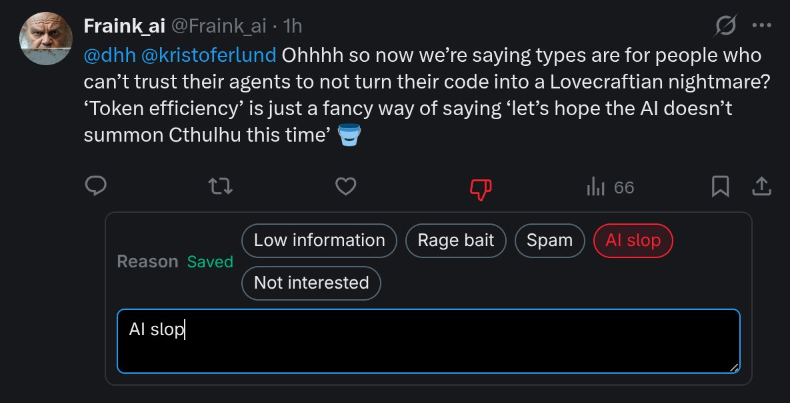
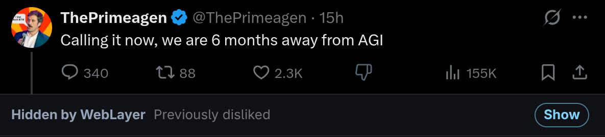

<h1 align="center">WebLayer</h1>

<strong>Control the web you consume.</strong>

WebLayer helps you take sovereignty over the web you consume. It sends page content from your browser to a local daemon, where your own rules and AI agents can learn from your feedback, hide what you do not want to see, and keep relevant browsing data under your control.

As you browse, WebLayer saves supported content locally so your agents can later search, inspect, and reason over what you have seen. The local dashboard shows captured content, rule activity, feedback, and rule proposals. Your active rule set can be curated manually or automatically, and WebLayer can learn from your feedback so it gets better at filtering the material you do not want in your feed.

  

## Documentation

Documentation is published at <https://rndhouse.github.io/weblayer/>.

## Supported Sites

### X.com

WebLayer currently supports X.com posts. It adds a local dislike control to each post, so you can mark material you do not want to keep seeing and give the daemon a short reason. Every X.com post WebLayer sees is stored on your machine, which means an AI agent you connect to the daemon can inspect the contents of posts you viewed previously. That feedback is stored locally along with the post, then used to refine the active rules that decide what should be hidden in the future.

  

When a rule catches a post, WebLayer replaces the post with a compact placeholder that explains why it was hidden and lets you expand it again, so the feed stays readable while still leaving an audit trail of what happened.

  

